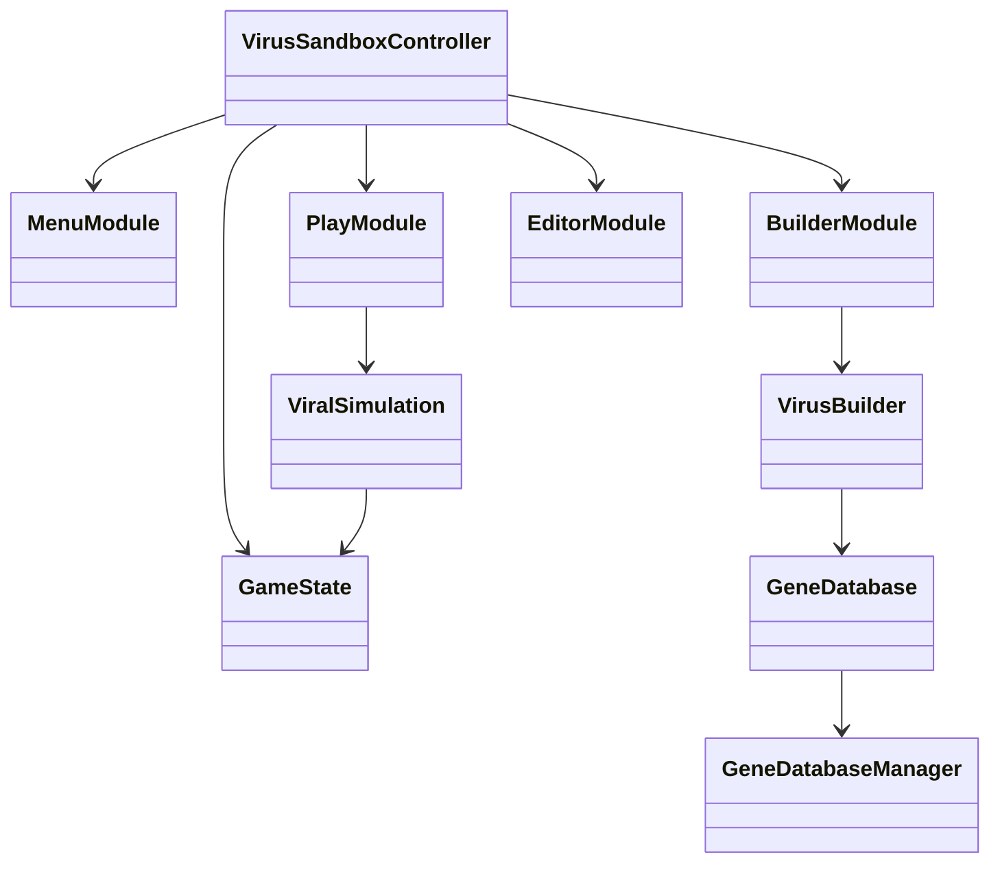

# Virus Sandbox Prototype

This repository hosts an experimental Python application that models basic viral mechanics using discrete turn-based simulation. The project is an unfinished prototype and not a complete game.

## Status

- Prototype quality; many features are incomplete or missing.
- Data formats and interfaces are unstable and may change.

## Architecture

- Single-file implementation: `viralsandbox.py`.
- Simulation rules and entities are described in JSON.
- Uses only Python standard library modules (Tkinter for GUI, json for storage, etc.).

### Core Classes

- **GeneDatabaseManager** – loads, saves and validates gene/entity databases.
- **GeneDatabase** – lightweight interface exposing gene data to builders and simulations.
- **VirusBuilder** – assembles viruses from selected genes and enforces prerequisites.
- **ViralSimulation** – executes the turn-based simulation and tracks milestones.
- **GameState** – holds mutable state such as selected genes, starter entity and stats.
- **Modules** – GUI screens built on the `GameModule` base class
  (e.g. `MenuModule`, `BuilderModule`, `PlayModule`, `EditorModule`).
- **VirusSandboxController** – orchestrates modules and maintains the shared `GameState`.

### Class Interaction



## Requirements

- Python 3.8 or newer.
- Tkinter library (bundled with most Python installations).

## Running

```bash
python viralsandbox.py
```

On first run, choose **Create Sample Database** to generate example genes and entities.

## Project Layout

- `viralsandbox.py` – main application.
- `requirements.txt` – list of used Python modules.
- `250817_virsim_default_24.json` – example database produced by the prototype.

## Development Notes

This repository is intended for experimentation and further development. Code lacks automated tests and extensive validation; contributions should focus on improving simulation accuracy, modular design, or data handling.

## License

Provided as-is for educational and research purposes.
